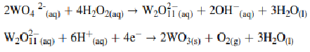

## Theory:

Amperometry is an electroanalytical technique that measures current at a constant applied potential. A constant voltage is applied between the working electrode and a reference electrode (or a counter electrode), and 
the resulting current is measured over time. Amperometry is recognized for its sensitivity and precision, and plays a pivotal role in diverse scientific domains, particularly in investigating electrochemical processes
 and developing thin film materials through techniques like electrodeposition. The technique can be advanced by enhancing the effectiveness of the working electrode and designing the photo electrocatalytic cells.
 The development of the working electrode involves the careful selection of an appropriate semiconductor and the implementation of a technique for preparing a thin film of the semiconductor on the supporting surface. 
 Within the spectrum of semiconductor materials, the tungsten trioxide semiconductor emerges as particularly compelling for serving as an anode electrode in oxidation reaction applications. This is attributed to its optimal
 bandgap energy, elevated positive potential in the valence band position, non-toxic nature, and remarkable stability.
 

The given experiment aims to develop an electrodeposition technique for tungsten oxide (WO3) thin film fabrication to improve photoelectrocatalytic activities for water oxidation applications. The deposition on conductive glass
is developed using the electrochemical amperometric methods to optimize the essential parameters that affect the photoelectrocatalytic properties of the fabricated WO3 electrode.  The chemical reaction for tungsten oxide (WO3) 
thin film preparation can be explained by the given equation.

The electrodeposition study was performed using a potentiostat, an electrochemical instrument
capable of precisely controlling and measuring the current response to an applied potential. It
facilitates chronoamperometric measurements by maintaining a constant potential between the
working and reference electrode while recording the resulting current over time.
The electrodeposition technique proves to be a notably efficient method for preparing thin films, characterized by its time efficiency, low energy consumption, and scalability for larger applications. Two primary modes govern 
electrodeposition thin film preparation: the applied potential mode and the applied current mode. This study concentrates on the applied potential mode, as it offers a versatile range of variables that enhance the overall 
efficiency of thin film preparation compared to alternative modes. The amperometric approach proves to be the most effective electrodeposition method for fabricating WO3 thin films under optimal conditions, achieved with a 
nitric acid concentration of 0.50 M and maintaining a potential of 0.5 V for 30 minutes.

 2WO4 2-(aq)+4H2O2(aq) --> W2O2-11(aq)+2OH-(aq)+3H2O(l)  
 W2O2-11(aq)+6H+(aq)+4e- --> 2WO3(s)+O2(g)+3H2O(l)
